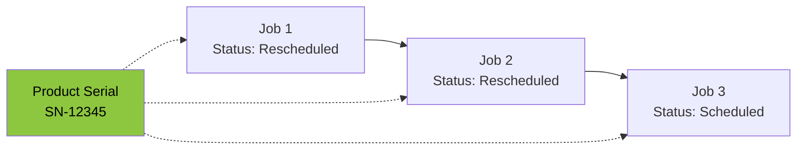

# Job Chain Tracking - Reschedule Monitoring

## Overview

The Job Chain Tracking feature monitors products that have been rescheduled multiple times. When a job is rescheduled, a new job is created with the same product serial number. This system links those jobs together to provide visibility into reschedule patterns.

## How It Works



All three jobs share the same `Product_Serial` and are linked in a **chain**. The system tracks:
- Total number of jobs in the chain
- Number of reschedules
- Days since first planned date
- Current status

## Database Schema

### Tables

#### `job_chains`
Stores metadata for each unique product serial chain.

| Column | Type | Description |
|--------|------|-------------|
| `chain_id` | UUID | Primary key |
| `product_serial` | TEXT | Unique product serial number |
| `carrier` | TEXT | Carrier code (BYDo, VALLEYc) |
| `total_jobs` | INTEGER | Total jobs in chain |
| `reschedule_count` | INTEGER | Number of rescheduled jobs |
| `first_planned_date` | DATE | Original planned date |
| `final_planned_date` | DATE | Most recent planned date |
| `total_delay_days` | INTEGER | Days from first planned to now |
| `current_status` | TEXT | Status of most recent job |
| `current_job_id` | TEXT | ID of most recent job |

#### `job_chain_links`
Links individual jobs to their chain.

| Column | Type | Description |
|--------|------|-------------|
| `id` | UUID | Primary key |
| `chain_id` | UUID | Foreign key to job_chains |
| `job_id` | TEXT | Job ID |
| `sequence_order` | INTEGER | Order in chain (1 = original) |
| `status` | TEXT | Job status |
| `planned_date` | DATE | Planned delivery date |
| `actual_date` | TIMESTAMP | Actual delivery date |
| `delay_days` | INTEGER | Days delayed |
| `reschedule_reason` | TEXT | Reason for reschedule |

### Setup

Run the SQL in `v2/setup_job_chains.sql` in your Supabase SQL Editor:

```sql
-- Copy contents of v2/setup_job_chains.sql and run in Supabase
```

## Alert Rules

The system automatically flags chains that meet these criteria:

| Severity | Condition | Meaning |
|----------|-----------|---------|
| 🔴 Critical | `reschedule_count >= 3` | Product rescheduled 3+ times |
| 🟡 Warning | `reschedule_count >= 2` | Product rescheduled twice |
| 🟡 Warning | `total_delay_days >= 14` | Delayed 2+ weeks from original date |

## Dashboard Tab

The **Reschedules** tab in the dashboard shows:

1. **KPI Cards**
   - Active Chains: Total products being tracked
   - Critical Alerts: Chains with 3+ reschedules
   - Warnings: Chains with 2 reschedules or 14+ day delays
   - High Frequency: Chains with 2+ reschedules

2. **Chain Alerts**
   - Visual alert cards for critical/warning chains
   - Shows product serial, carrier, reschedule count
   - Displays current job ID for quick lookup

3. **All Active Chains Table**
   - Complete list of tracked product chains
   - Sortable by reschedule count
   - Shows current status and delay days

4. **Rescheduled Jobs in Current View**
   - Jobs with "Rescheduled" status in current filter
   - Useful for same-day analysis

## Python API

### Process Chains (Daily Import)

```python
from v2.job_chains import process_job_chains
from v2.supabase_client import SupabaseClient

supabase = SupabaseClient()
stats = process_job_chains(df_processed, supabase.client)

print(f"Chains processed: {stats['chains_processed']}")
print(f"New chains: {stats['new_chains_created']}")
print(f"Jobs linked: {stats['jobs_linked']}")
```

### Get Alerts

```python
from v2.job_chains import get_chain_alerts

alerts = get_chain_alerts(supabase.client)
for alert in alerts:
    print(f"{alert['severity']}: {alert['product_serial']} - {alert['message']}")
```

### Query Chains

```python
from v2.job_chains import JobChainManager

manager = JobChainManager(supabase.client)

# Get all active chains
active = manager.get_active_chains()

# Get chains with 2+ reschedules
high_freq = manager.get_active_chains(min_reschedules=2)

# Get all jobs in a chain
links = manager.get_chain_links(chain_id)
```

## Integration Points

### Daily Import (`v2/main.py`)

Chain processing runs automatically during daily import:
1. Data loaded from Excel export
2. KPIs calculated
3. Snapshot stored in Supabase
4. **Job chains processed** ← New step
5. **Chain alerts generated** ← New step

### Dashboard (`BYD_Valley_Job_Tracker.py`)

The Reschedules tab reads from Supabase:
- Chain alerts displayed in real-time
- Active chains table shows all tracked products
- Rescheduled jobs in current filter view

## Troubleshooting

### "No active reschedule chains found"

This means either:
1. Daily import hasn't run yet - run `python v2/main.py`
2. No products have been rescheduled multiple times
3. Database tables not created - run `v2/setup_job_chains.sql`

### "Unable to load chain data from database"

Check:
1. Supabase credentials in `.env`
2. Tables exist in Supabase
3. Network connectivity

### Missing Product Serials

Jobs without a `Product_Serial` value are skipped during chain detection. Ensure your FileMaker export includes the `product_serial_number` field.

## Future Enhancements

Potential improvements:
- [ ] Email notifications for critical alerts
- [ ] Reschedule reason tracking (extract from notes)
- [ ] Historical chain analytics (trends over time)
- [ ] Carrier performance comparison
- [ ] Auto-escalation rules